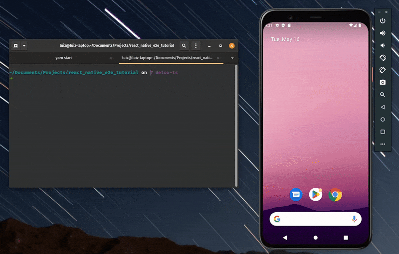

<h1 align="center">🧪️End-to-end testing with React Native and Detox⚛️</h1>

<h3 align="center">🤖️Learning the basics of E2E testing with the Detox library🤖️</h3>

  This project was created based on Rocketseat's <a href="https://www.youtube.com/watch?v=V_BUjfBBYGI" style="text-decoration: none;">video</a>, but updated to Detox 20 and React Native 0.70.7 (currently the newest version recommended by Detox).

<h5>🧪️Comandos para executar os testes: 🧪️</h5>
<ol>
  <li>Start the Metro bundler with <code>yarn start</code></li>
  <li>
    Execute <code>yarn detox build --configuration &ltos.device.config&gt</code> to build the app with   testing dependencies
  </li>
  <li>
    Execute <code>yarn detox test --configuration &ltos.device.config&gt</code> to run the tests in the desired platform
  </li>
</ol>

> ##### P.S.
> Do not forget to add your devices configurations at <b>.detoxrc.js</b>

